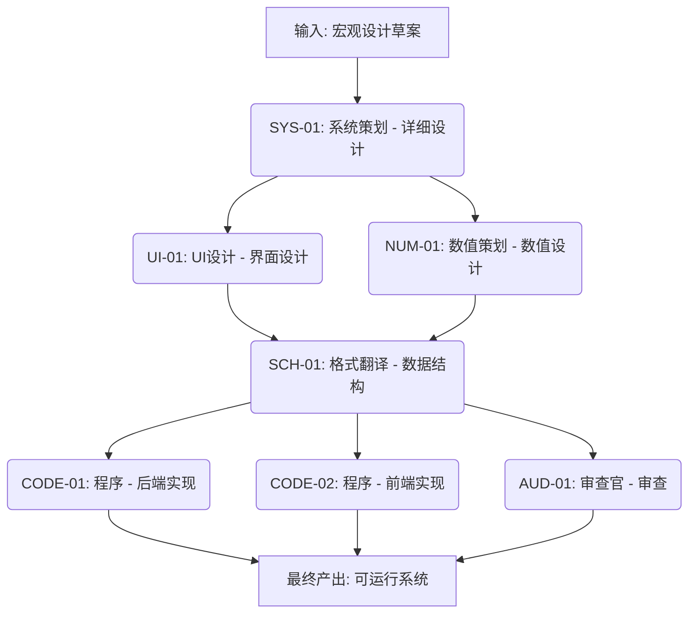

好的，资深游戏开发项目经理 (PM) 收到。

以下是根据终审通过的《背包系统 - 宏观设计草案》进行的 WBS 拆解计划。

---

## 背包系统 - WBS 任务拆解计划

### 1. 任务分解

#### 1.1 下游 Agent：System Planner (系统策划)

- **任务 ID**: SYS-01
- **任务名称**: 背包系统详细玩法与交互逻辑设计
- **输入文件**: `背包系统 - 宏观设计草案.md`
- **产出文件**: `背包系统_详细设计.md`
- **具体任务**:
    1.  **道具分类细化**: 将草案中的6大类道具（消耗品、装备、礼物等）细化为具体的子类型和标签（如：消耗品->体力药水、经验书、技能材料），并定义每种道具的基础属性模板（ID、名称、图标、描述、堆叠上限、稀有度、类型标签）。
    2.  **UI交互流程设计**: 设计背包界面的完整交互流程，包括：
        - 主界面布局（分类Tab、列表区、筛选/排序栏、搜索框）。
        - 道具卡片点击后的详情弹窗（展示道具属性、来源、用途）。
        - “使用”、“分解/出售”、“合成”按钮的点击状态、前置条件校验逻辑、成功/失败反馈。
        - 排序和筛选的交互逻辑（点击排序按钮、选择筛选条件）。
    3.  **容量与扩容逻辑设计**: 明确初始容量、扩容道具的ID、每次扩容增加的格数、扩容上限、溢出邮件的具体规则（邮件ID、保留时长、删除逻辑）。
    4.  **合成系统逻辑设计**: 定义合成配方的数据结构（所需材料ID、数量、产出道具ID、数量），以及合成操作的完整流程（打开合成界面、选择配方、校验材料、执行合成、产出道具）。
    5.  **边界与异常处理**: 详细描述所有操作的边界情况，如：背包满时点击“使用”道具、分解已装备的道具、合成时材料不足、网络中断等情况的处理逻辑。

#### 1.2 下游 Agent：UI Agent (UX/UI 设计)

- **任务 ID**: UI-01
- **任务名称**: 背包系统前端界面与交互设计
- **输入文件**: `背包系统_详细设计.md` (由 SYS-01 产出)
- **产出文件**: `背包系统_UI设计稿.md` (含界面布局、交互原型、视觉规范)
- **具体任务**:
    1.  **界面布局设计**: 根据 SYS-01 的交互流程，设计背包主界面、详情弹窗、合成界面、扩容界面的高保真原型图。
    2.  **视觉规范制定**: 定义背包界面的整体视觉风格（毛玻璃、纯色背景、极简纹理），道具卡片样式（图标尺寸、稀有度边框颜色、角标设计），按钮样式，字体规范。
    3.  **交互原型制作**: 制作可交互的原型，展示所有操作（点击、滑动、筛选、排序）的动效和反馈。
    4.  **资源清单输出**: 输出所有需要美术制作的资源清单（如：道具图标、UI组件、背景图、按钮素材等），并明确尺寸和格式要求。

#### 1.3 下游 Agent：Numerical Planner (数值策划)

- **任务 ID**: NUM-01
- **任务名称**: 背包系统经济数值与扩容定价设计
- **输入文件**: `背包系统_详细设计.md` (由 SYS-01 产出)
- **产出文件**: `背包系统_数值表.json`
- **具体任务**:
    1.  **扩容定价曲线**: 设计使用基础货币（金币）扩容的每日限购价格曲线（如：第1次1000金币，第2次2000金币...），以及使用付费货币扩容的固定单价。
    2.  **分解/出售回收公式**: 为每种可分解/出售的道具定义回收公式，确保回收价值合理，不破坏经济平衡。
    3.  **合成配方消耗平衡**: 审核 SYS-01 产出的合成配方，确保材料消耗与产出道具的价值相匹配，避免出现“合成不如直接分解”或“合成成本过高”的情况。
    4.  **扩容礼包定价**: 设计“背包扩容礼包”的定价和内容，使其成为有吸引力的轻度付费点。

#### 1.4 下游 Agent：Schema Translator (格式翻译)

- **任务 ID**: SCH-01
- **任务名称**: 背包系统数据结构与接口定义
- **输入文件**: `背包系统_详细设计.md` (由 SYS-01 产出), `背包系统_数值表.json` (由 NUM-01 产出)
- **产出文件**: `背包系统_数据Schema.json`
- **具体任务**:
    1.  **道具数据结构定义**: 将 SYS-01 中的道具属性模板转化为 JSON Schema，定义 `Item` 对象的所有字段（ID, name, icon, type, rarity, stackable, maxStack, description, source, usage 等）。
    2.  **背包数据结构定义**: 定义玩家背包的数据结构 `PlayerInventory`，包含 `items` (道具列表), `maxSlots` (最大格数), `currentSlots` (当前已用格数) 等字段。
    3.  **API接口定义**: 定义所有与背包相关的后端 API 接口，包括：
        - `GET /inventory` (获取背包数据)
        - `POST /inventory/use` (使用道具)
        - `POST /inventory/decompose` (分解道具)
        - `POST /inventory/craft` (合成道具)
        - `POST /inventory/expand` (扩容)
        - `POST /inventory/sort` (排序)
        - `POST /inventory/filter` (筛选)
    4.  **数据同步协议定义**: 定义前端与后端之间关于道具增删改查的实时同步协议，确保数据一致性。

#### 1.5 下游 Agent：Code Agent (程序执行)

- **任务 ID**: CODE-01
- **任务名称**: 背包系统后端逻辑与API实现
- **输入文件**: `背包系统_数据Schema.json` (由 SCH-01 产出)
- **产出文件**: `背包系统_后端代码.gd` (或对应语言的代码文件)
- **具体任务**:
    1.  **数据库表创建**: 根据 Schema 创建 `items` 和 `player_inventories` 等数据库表。
    2.  **API接口实现**: 实现 SCH-01 定义的所有 API 接口，包括数据校验、业务逻辑处理、数据库读写。
    3.  **数据一致性保障**: 实现事务回滚机制和锁/队列机制，确保多系统并发操作时的数据一致性。
    4.  **邮件系统对接**: 实现背包满时道具自动进入邮件系统的逻辑，以及邮件过期自动删除的逻辑。

- **任务 ID**: CODE-02
- **任务名称**: 背包系统前端UI与交互实现
- **输入文件**: `背包系统_UI设计稿.md` (由 UI-01 产出), `背包系统_数据Schema.json` (由 SCH-01 产出)
- **产出文件**: `背包系统_前端代码.gd` (或对应语言的代码文件)
- **具体任务**:
    1.  **UI界面搭建**: 根据 UI 设计稿，使用游戏引擎搭建背包主界面、详情弹窗、合成界面等所有 UI 组件。
    2.  **交互逻辑实现**: 实现所有 UI 交互逻辑，包括点击、滑动、筛选、排序、搜索等。
    3.  **数据绑定**: 将 UI 组件与后端 API 返回的数据进行绑定，实现数据的动态展示。
    4.  **性能优化**: 实现虚拟列表或分页加载技术，优化大量道具加载时的性能。

#### 1.6 下游 Agent：Audit Agent (审查官)

- **任务 ID**: AUD-01
- **任务名称**: 背包系统数值与数据一致性审查
- **输入文件**: `背包系统_数值表.json` (由 NUM-01 产出), `背包系统_数据Schema.json` (由 SCH-01 产出)
- **产出文件**: `背包系统_审查报告.md`
- **具体任务**:
    1.  **数值平衡性审查**: 审查扩容定价、分解回收公式、合成配方消耗是否合理，是否会对游戏经济系统造成冲击。
    2.  **数据一致性审查**: 审查 Schema 定义是否完整、准确，API 接口设计是否合理，事务回滚机制是否覆盖所有关键操作。
    3.  **边界与异常审查**: 审查 SYS-01 中定义的边界与异常处理逻辑是否在 Schema 和 API 设计中得到体现。

---

### 2. 执行顺序与依赖

- **串行依赖**:
    - `SYS-01` (系统策划) 是**所有下游任务的前置条件**。必须先完成详细设计，UI、数值、Schema 翻译才能开始。
    - `UI-01` 和 `NUM-01` 是 `SCH-01` 的前置条件。Schema 翻译需要同时参考 UI 设计稿和数值表。
    - `SCH-01` 是 `CODE-01`、`CODE-02` 和 `AUD-01` 的前置条件。所有下游任务都需要基于最终确定的数据结构。

- **可并行任务**:
    - `UI-01` (UI设计) 和 `NUM-01` (数值设计) 可以**完全并行**，因为它们依赖的输入相同（SYS-01的产出），且彼此之间没有直接依赖关系。
    - `CODE-01` (后端实现) 和 `CODE-02` (前端实现) 可以**并行开发**，只要它们都遵循 `SCH-01` 定义的接口协议。
    - `AUD-01` (审查) 可以与 `CODE-01` 和 `CODE-02` **部分并行**。审查可以提前开始，但最终报告需要在代码开发完成前输出，以便及时修正问题。

---

### 3. 风险提示

- **阻塞点 1: 系统策划产出延迟**
    - **风险**: `SYS-01` 是所有下游任务的起点，如果系统策划的详细设计文档延迟交付，整个项目将陷入停滞。
    - **缓解措施**: PM 需与系统策划紧密沟通，设定明确的交付里程碑，并预留缓冲时间。同时，UI 和数值策划可以在等待期间进行技术预研或竞品分析。

- **阻塞点 2: 多系统数据一致性冲突**
    - **风险**: 背包系统作为数据中枢，与战斗、养成、商城等多个系统有数据交互。如果 `SCH-01` 定义的数据同步协议不够严谨，或 `CODE-01` 实现的事务回滚机制有漏洞，极易导致数据不一致的严重 Bug。
    - **缓解措施**: 在 `SCH-01` 阶段，必须组织所有相关系统的开发人员（战斗、养成、商城等）进行接口评审。`AUD-01` 的审查重点应放在数据一致性上。`CODE-01` 实现时，需编写单元测试覆盖所有并发操作场景。

- **阻塞点 3: UI 设计稿与 Schema 定义脱节**
    - **风险**: UI 设计稿可能包含一些 Schema 中未定义的数据展示需求（如：道具的“来源”信息），导致前端开发时发现数据缺失。
    - **缓解措施**: `SCH-01` 翻译时，必须严格对照 `UI-01` 的设计稿，确保 Schema 包含了 UI 展示所需的所有字段。建议在 `SCH-01` 产出后，由 UI 设计师和 Schema 翻译者共同进行一次“数据-UI”对齐会议。

- **跨团队依赖冲突**:
    - **风险**: 背包系统的扩容道具、合成配方等，可能依赖于其他系统（如商城系统、活动系统）的产出。如果这些系统的开发进度滞后，背包系统的功能将无法完整测试。
    - **缓解措施**: PM 需在项目初期就识别出这些跨系统依赖，并在项目排期中为这些依赖项设置明确的“依赖就绪”检查点。如果依赖项延迟，需及时调整背包系统的测试计划，或开发 Mock 数据用于自测。