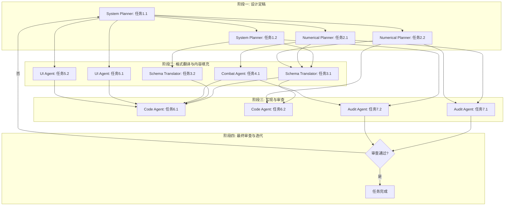

好的，这是根据终审通过的系统设计草案和下游团队能力花名册，制定的 WBS 任务拆解计划。

## 1. 任务分解

### System Planner (系统策划)
- **任务 1.1: 系统玩法闭环与模块划分**
  - **输入文件**: `系统设计草案.md`
  - **产出文件**: `Dormitory_System_Design.md`
    - 内容: 详细定义“进入房间”、“自由视角”、“触摸反馈”、“好感度对话”、“换装展示”等功能的交互流程、状态机、UI 层级关系。
    - 定义 `PlayerDormitoryData` 的数据结构草案（字段名、类型、用途）。
    - 定义好感度等级与解锁内容的映射关系表（等级 -> 对话ID、姿势ID、家具ID）。
    - 定义每日互动次数上限的规则与重置逻辑。

- **任务 1.2: 触摸反馈区域与反馈映射表**
  - **输入文件**: `Dormitory_System_Design.md`
  - **产出文件**: `Touch_Feedback_Map.md`
    - 内容: 定义角色身体可触摸区域（头、手、脸、胸、臀等）的碰撞体命名规范。
    - 定义每个区域触摸后触发的反馈组合（语音ID、表情ID、动作ID、Jiggle Physics 强度等级）。

### Numerical Planner (数值策划)
- **任务 2.1: 好感度成长曲线与解锁条件**
  - **输入文件**: `Dormitory_System_Design.md`, `Touch_Feedback_Map.md`
  - **产出文件**: `Affection_Growth_Table.xlsx`
    - 内容: 设计每日互动获得的好感度经验值。设计从 Lv1 到 LvMax 每级所需的累计经验值。设计每个等级解锁的具体内容（对话、姿势、家具）的数值门槛。

- **任务 2.2: 买断制商品定价与家具礼包定价**
  - **输入文件**: `系统设计草案.md`
  - **产出文件**: `Shop_Price_Config.xlsx`
    - 内容: 确定“私人宿舍”核心模块的定价（如：¥30 / $4.99）。确定“和风”、“现代简约”等家具套装的定价（如：¥12 / $1.99）。

### Schema Translator (格式翻译)
- **任务 3.1: 翻译系统设计为 JSON Schema**
  - **输入文件**: `Dormitory_System_Design.md`, `Affection_Growth_Table.xlsx`, `Shop_Price_Config.xlsx`
  - **产出文件**: `Dormitory_System_Schema.json`
    - 内容: 将 `PlayerDormitoryData` 的结构、好感度等级映射、触摸反馈映射、商品定价等所有业务逻辑，翻译为结构化的 JSON Schema 文件。

- **任务 3.2: 翻译触摸反馈映射为 JSON Schema**
  - **输入文件**: `Touch_Feedback_Map.md`
  - **产出文件**: `Touch_Feedback_Schema.json`
    - 内容: 将身体区域与反馈组合的映射关系，翻译为结构化的 JSON Schema 文件。

### Combat Agent (战斗策划)
- **任务 4.1: 设计好感度对话与剧情片段**
  - **输入文件**: `Dormitory_System_Design.md`, `Affection_Growth_Table.xlsx`
  - **产出文件**: `Affection_Dialogue_Config.json`
    - 内容: 为每个好感度等级设计 2-3 条专属对话选项。为特定等级设计触发亲密剧情片段的逻辑。输出包含对话ID、文本内容、触发条件、关联姿势ID的 JSON 文件。

### UI Agent (UX/UI 设计)
- **任务 5.1: 设计宿舍系统 UI 视觉规范**
  - **输入文件**: `Dormitory_System_Design.md`, `Dormitory_System_Schema.json`
  - **产出文件**: `Dormitory_UI_Style_Guide.md`
    - 内容: 定义进入房间的运镜 UI（黑边、文字提示）。定义极简互动 UI 的样式（半透明按钮、隐藏规则）。定义好感度进度条、对话气泡、触摸反馈提示的视觉风格、颜色、字体、图标。

- **任务 5.2: 生成家具与装饰的 Midjourney 提示词**
  - **输入文件**: `Dormitory_System_Design.md`
  - **产出文件**: `Furniture_MJ_Prompts.md`
    - 内容: 为“和风”、“现代简约”等家具套装，生成用于 Midjourney 生成概念图的提示词。

### Code Agent (程序执行)
- **任务 6.1: 实现宿舍系统核心逻辑**
  - **输入文件**: `Dormitory_System_Schema.json`, `Touch_Feedback_Schema.json`, `Affection_Dialogue_Config.json`
  - **产出文件**: `dormitory_system.gd`, `touch_feedback.gd`, `affection_manager.gd` 等 GDScript 文件。
    - 内容: 实现房间加载、角色展示、自由视角控制、触摸检测与反馈播放、好感度逻辑、对话系统、换装展示、数据持久化（`PlayerDormitoryData`）。

- **任务 6.2: 实现商城与宿舍系统的数据联动**
  - **输入文件**: `Dormitory_System_Schema.json`, `Shop_Price_Config.xlsx`
  - **产出文件**: `shop_dormitory_integration.gd`
    - 内容: 实现商城购买“私人宿舍”模块后，解锁 `PlayerDormitoryData` 的权限。实现购买家具礼包后，更新房间自定义数据。

### Audit Agent (审查官)
- **任务 7.1: 审查数值平衡性**
  - **输入文件**: `Affection_Growth_Table.xlsx`, `Shop_Price_Config.xlsx`
  - **产出文件**: `Audit_Report_Numerical.md`
    - 内容: 审查好感度成长曲线是否平滑，是否存在“卡点”。审查商品定价是否符合市场预期与付费模型。审查每日互动次数上限是否合理。

- **任务 7.2: 审查系统设计与底线合规**
  - **输入文件**: `Dormitory_System_Design.md`, `Touch_Feedback_Map.md`, `Affection_Dialogue_Config.json`
  - **产出文件**: `Audit_Report_System.md`
    - 内容: 审查触摸反馈、对话内容是否严格遵守“擦边底线”，是否存在任何脱衣、露点或模拟性行为的逻辑。审查 UI 极简化是否达到“屏幕 90% 以上区域用于展示角色”的要求。

## 2. 执行顺序与依赖

**并行任务**:
- **阶段一**: `任务1.1` 与 `任务2.1`、`任务2.2` 可以并行。`任务1.2` 必须在 `任务1.1` 之后。
- **阶段二**: `任务3.1`、`任务3.2`、`任务4.1`、`任务5.1`、`任务5.2` 可以并行。
- **阶段三**: `任务6.1` 与 `任务6.2` 可以并行。`任务7.1` 与 `任务7.2` 可以并行。

**串行依赖**:
- `任务1.1` -> `任务1.2` -> `任务3.1` / `任务3.2` -> `任务6.1`
- `任务2.1` -> `任务3.1` -> `任务6.1`
- `任务2.2` -> `任务3.1` -> `任务6.2`
- `任务1.1` -> `任务5.1` / `任务5.2` -> `任务6.1`
- `任务2.1` / `任务2.2` -> `任务7.1`
- `任务1.2` / `任务4.1` -> `任务7.2`

## 3. 风险提示

1.  **触摸反馈实现阻塞点**:
    - **风险**: `Code Agent` 在实现 `Touch_Feedback_Schema.json` 时，需要与 `Combat Agent` 或专门的动画/音频团队协作，获取具体的语音、表情、动作资源 ID。如果这些资源尚未制作完成，会导致代码无法联调。
    - **缓解**: 在 `Touch_Feedback_Map.md` 中，`System Planner` 应使用占位符 ID，并提前与资源制作团队对齐资源交付时间表。

2.  **UI 极简化与触摸反馈冲突**:
    - **风险**: `UI Agent` 设计的极简 UI 可能遮挡触摸区域，或触摸反馈的 UI 提示（如文字气泡）与极简原则冲突。
    - **缓解**: `UI Agent` 与 `System Planner` 需在 `Dormitory_System_Design.md` 中明确 UI 元素的层级（z-order）和碰撞体穿透规则。触摸反馈提示应设计为可配置的（如：仅显示图标，不显示文字）。

3.  **好感度系统与旧系统数据联动冲突**:
    - **风险**: 旧的好感度系统可能没有预留“宿舍专属对话”或“宿舍专属姿势”的接口。`Code Agent` 在实现 `affection_manager.gd` 时，可能需要修改旧系统的数据结构或接口，导致跨团队依赖。
    - **缓解**: 在 `Dormitory_System_Design.md` 中，`System Planner` 必须明确标注需要新增的全局接口（如 `GetDormitoryDialogueList(roleId, affectionLevel)`），并提前与旧系统负责人沟通接口变更计划。

4.  **“擦边底线”审查标准不一致**:
    - **风险**: `Audit Agent` 对“擦边底线”的理解可能与 `System Planner` 和 `Combat Agent` 不一致，导致反复驳回，影响进度。
    - **缓解**: 在项目启动前，由制作人或主策牵头，与所有相关 Agent 共同制定一份明确的“内容红线文档”，作为审查的硬性标准。`Audit Agent` 的审查报告应引用该文档的具体条款。