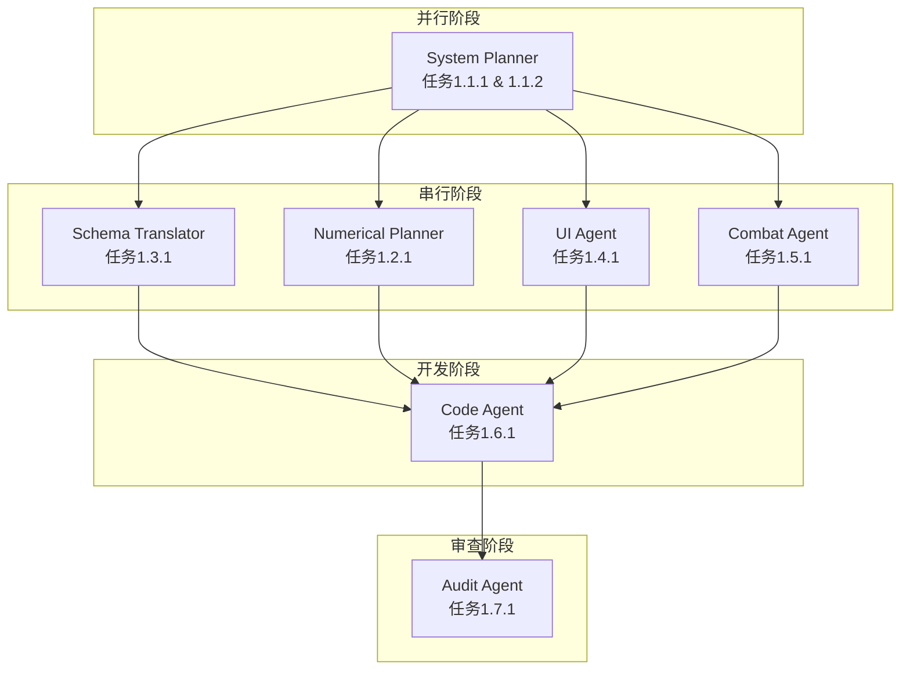

好的，资深游戏开发项目经理。已收到终审通过的《温泉中心》系统设计草案。现在，我将根据该草案，结合项目宪法与记忆库中的最佳实践，进行WBS拆解，并明确下游各Agent的任务、依赖与风险。

---

## 温泉中心 - WBS 任务拆解计划

### 1. 任务分解

以下为各下游Agent的具体任务、输入与产出文件。

#### 1.1 System Planner (系统策划)

- **任务 1.1.1：温泉中心系统详细设计**
    - **输入文件**：`温泉中心 - 宏观设计草案.md`
    - **产出文件**：`温泉中心_系统详细设计.md`
    - **具体内容**：
        1.  **系统定位与规则**：明确“温泉中心”作为“宿舍系统”的子模块，定义其入口、加载、退出逻辑。明确数据归属（全局存档），并严格区分“功能实现细节”与“项目规则定位”（如：不在此处描述UI表现，只描述数据状态变化）。
        2.  **角色刷新规则**：详细设计角色池、刷新权重（基础权重+今日特惠）、刷新消耗（基础货币）、每日免费次数、换人逻辑。
        3.  **小游戏 - 水枪射击**：详细设计玩法流程（进入、瞄准、射击、命中判定、计时、结算）、靶子生成逻辑（位置、类型、消失）、奖励触发条件（命中数阈值）。
        4.  **小游戏 - 捞水球**：详细设计玩法流程（进入、点击/拖拽、捞取判定、计时、结算）、水球生成逻辑（位置、颜色、移动）、奖励触发条件（捞取数阈值）。
        5.  **奖励系统**：定义奖励类型（专属表情/语音/动作）、解锁方式（永久解锁）、每日奖励限制（每个角色每日1次，两小游戏共享）。
        6.  **边界与异常**：定义玩家无角色时的入口状态、小游戏失败处理、网络中断处理等。

- **任务 1.1.2：温泉中心系统数据表设计**
    - **输入文件**：`温泉中心_系统详细设计.md`
    - **产出文件**：`温泉中心_数据表设计.md`
    - **具体内容**：
        1.  **核心数据表**：`player_hotspring_data` (玩家ID, 今日特惠角色ID, 免费刷新次数, 小游戏奖励记录等)。
        2.  **角色数据表**：`character_hotspring_data` (角色ID, 已解锁表情列表, 已解锁语音列表, 已解锁动作列表)。
        3.  **配置表**：`hotspring_config` (刷新基础权重, 刷新消耗, 小游戏时间限制, 命中阈值等)。
        4.  **奖励表**：`hotspring_reward_table` (奖励ID, 角色ID, 奖励类型, 解锁条件, 关联小游戏ID)。

#### 1.2 Numerical Planner (数值策划)

- **任务 1.2.1：温泉中心经济数值设计**
    - **输入文件**：`温泉中心_系统详细设计.md`, `温泉中心_数据表设计.md`
    - **产出文件**：`温泉中心_数值表.xlsx`
    - **具体内容**：
        1.  **刷新消耗**：定义每次刷新消耗的基础货币数量，以及每日免费次数用完后，额外购买次数的价格曲线。
        2.  **小游戏难度**：定义靶子/水球的生成速度、移动速度、大小，确保大部分玩家在1-2次尝试内能达成奖励条件。
        3.  **奖励解锁**：定义每个角色至少3个解锁位，确保内容量充足。
        4.  **付费道具定价**：为“刷新券”、“小游戏次数重置券”设定合理价格（与基础货币兑换比例挂钩）。

#### 1.3 Schema Translator (格式翻译)

- **任务 1.3.1：温泉中心系统 JSON Schema 生成**
    - **输入文件**：`温泉中心_系统详细设计.md`, `温泉中心_数据表设计.md`
    - **产出文件**：`温泉中心_系统Schema.json`
    - **具体内容**：
        1.  将System Planner的详细设计翻译为结构化的JSON Schema，包含所有数据表、配置表、奖励表的字段定义、类型、约束。
        2.  确保Schema与下游Code Agent的GDScript代码生成需求对齐。

#### 1.4 UI Agent (UX/UI 设计)

- **任务 1.4.1：温泉中心 UI/UX 设计稿**
    - **输入文件**：`温泉中心_系统详细设计.md`
    - **产出文件**：`温泉中心_UI设计稿.fig` (或 `温泉中心_UI设计稿.md`)
    - **具体内容**：
        1.  **主场景UI**：设计半透明毛玻璃UI组件（角色信息、小游戏入口、换人按钮、拍照按钮、隐藏UI按钮）。
        2.  **小游戏UI**：设计水枪射击的准星、计时器、得分板；设计捞水球的拖拽提示、进度条。
        3.  **奖励UI**：设计解锁内容预览弹窗、图鉴回看界面。
        4.  **运镜设计**：定义默认镜头角度、小游戏触发时的特写镜头、镜头旋转/缩放限制。
        5.  **UI透明化**：确保所有UI不遮挡角色主体，小游戏进行时自动隐藏非必要UI。

#### 1.5 Combat Agent (战斗策划)

- **任务 1.5.1：小游戏战斗逻辑配置**
    - **输入文件**：`温泉中心_系统详细设计.md`
    - **产出文件**：`温泉中心_小游戏配置.json`
    - **具体内容**：
        1.  **水枪射击**：配置射击判定逻辑（射线检测）、命中反馈（靶子爆裂、水花特效）、角色反馈（表情、语音）。
        2.  **捞水球**：配置点击/拖拽判定逻辑、水球破裂反馈、角色反馈。

#### 1.6 Code Agent (程序执行)

- **任务 1.6.1：温泉中心核心逻辑开发**
    - **输入文件**：`温泉中心_系统Schema.json`, `温泉中心_UI设计稿.fig`, `温泉中心_小游戏配置.json`
    - **产出文件**：`HotSpringCenter.gd`, `HotSpringGame.gd`, `HotSpringUI.gd` 等GDScript代码文件。
    - **具体内容**：
        1.  实现场景加载、角色刷新、数据读写、小游戏逻辑、奖励发放、UI交互等所有功能。
        2.  实现与宿舍系统、图鉴系统、好感度系统的数据联动。

#### 1.7 Audit Agent (审查官)

- **任务 1.7.1：温泉中心系统审查**
    - **输入文件**：`温泉中心_系统Schema.json`, `温泉中心_数值表.xlsx`, `温泉中心_UI设计稿.fig`
    - **产出文件**：`温泉中心_审查报告.md`
    - **具体内容**：
        1.  **数值平衡审查**：检查刷新消耗、小游戏难度、奖励解锁条件是否合理，是否符合“轻度休闲”定位。
        2.  **系统闭环审查**：检查经济循环是否闭环（不产出战斗数值），付费点是否合理（不逼氪）。
        3.  **合规审查**：检查UI设计、角色反馈、擦边底线是否符合项目宪法与分级标准。

### 2. 执行顺序与依赖

- **并行任务**：System Planner、Numerical Planner、UI Agent、Combat Agent 可以**并行**工作，因为他们都基于同一个输入文件（宏观设计草案），且产出物相互独立。
- **串行任务**：Schema Translator 必须在 System Planner 完成后才能开始，因为它需要System Planner的详细设计作为输入。
- **开发阶段**：Code Agent 必须等待 Schema Translator、Numerical Planner、UI Agent、Combat Agent 全部完成后才能开始，因为它需要所有上游的产出物作为输入。
- **审查阶段**：Audit Agent 必须在 Code Agent 完成后才能开始，因为它需要审查最终实现是否符合设计。

### 3. 风险提示

- **阻塞点 1：内容生产量（美术/音频）**
    - **风险**：每个角色需要独立制作泳装/浴巾模型、湿发效果、5-8条语音、3-5个表情、2个小游戏反馈动画。首批仅覆盖3-5个角色，但后续角色更新速度可能跟不上玩家消耗速度。
    - **缓解措施**：在System Planner中明确“分批更新”策略，并为未覆盖角色提供“即将上线”提示。同时，与美术/音频团队提前沟通，确保产能计划。

- **阻塞点 2：小游戏平衡性**
    - **风险**：水枪射击与捞水球的难度若设计不当，可能导致玩家挫败感，违背“轻度休闲”定位。
    - **缓解措施**：Numerical Planner需进行多轮数值推演，确保大部分玩家可在1-2次尝试内完成。同时，提供“跳过”选项（消耗基础货币）作为兜底。

- **阻塞点 3：合规风险**
    - **风险**：角色泳装/浴巾装扮、水面高度、角色反馈（被水花溅到）等，若尺度把控不当，可能触及分级红线。
    - **缓解措施**：UI Agent与Combat Agent在设计时需严格遵守项目宪法中的“擦边底线”。Audit Agent在审查阶段需重点检查此项，并与法务/合规团队提前沟通。

- **跨团队依赖冲突**：
    - **冲突点**：UI Agent设计的“隐藏UI”功能，可能与Code Agent实现的“小游戏UI”逻辑冲突（如：隐藏UI后，小游戏计时器/得分板是否也应隐藏？）。
    - **缓解措施**：在System Planner的详细设计中，需明确“小游戏进行时，UI自动隐藏，仅保留准星/操作提示”的规则，确保UI Agent与Code Agent理解一致。