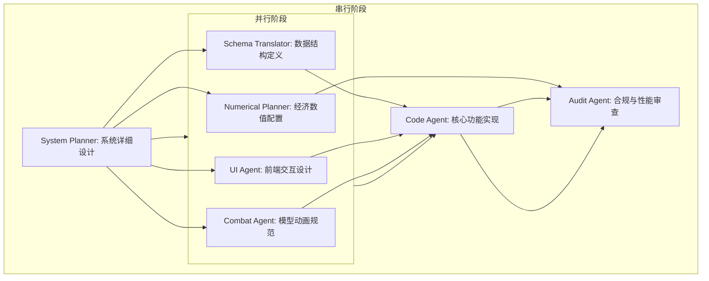

好的，资深游戏开发项目经理。已收到终审通过的角色宿舍设计草案。现在，我将基于该草案，结合项目宪法与RAG记忆库中的最佳实践，进行WBS任务拆解。

---

## 角色宿舍系统 - WBS 任务拆解计划

### 1. 任务分解

以下为各下游Agent的具体任务、输入与产出。

| Agent | 任务描述 | 输入文件 | 产出文件 |
| :--- | :--- | :--- | :--- |
| **System Planner** | **1. 系统详细设计**：将宏观草案细化为可执行的系统逻辑，包括： 1. 方案保存/切换的完整数据流与状态机。 2. 场景布置的交互逻辑（放置、旋转、缩放、碰撞检测）。 3. 拍照模式的UI/UX交互流程。 4. 换装、姿势、表情切换的UI与数据联动逻辑。 5. 画质分级选项的具体实现方案。 6. 与商城、图鉴、活动系统的数据同步接口定义。 | `角色宿舍-宏观设计草案.md` `项目宪法.md` | `角色宿舍-系统详细设计.md` |
| **Numerical Planner** | **2. 经济数值与商业化配置**： 1. 定义所有付费道具（皮肤、场景、家具、滤镜等）的定价策略与货币类型。 2. 定义免费内容与付费内容的解锁比例与节奏。 3. 定义方案槽位的定价。 4. 确认无任何资源产出循环，确保系统纯消费定位。 | `角色宿舍-宏观设计草案.md` `项目宪法.md` | `角色宿舍-经济数值表.json` |
| **Schema Translator** | **3. 数据结构与接口定义**： 1. 将系统详细设计中的数据结构（如：方案数据、场景配置、角色装扮状态）转化为JSON Schema。 2. 定义宿舍系统与商城、图鉴、活动系统的数据同步接口Schema。 3. 定义拍照数据的存储格式。 | `角色宿舍-系统详细设计.md` | `角色宿舍-数据Schema.json` `角色宿舍-接口定义.json` |
| **UI Agent** | **4. 前端交互与表现配置**： 1. 设计换装、姿势、表情切换的UI组件与交互反馈。 2. 设计场景布置的拖拽、旋转、缩放UI。 3. 设计拍照模式的UI布局与滤镜/特效选择器。 4. 设计方案保存/切换的UI流程。 5. 设计画质分级选项的UI。 6. 确保所有UI遵循“半透明毛玻璃”与“一键隐藏”原则。 | `角色宿舍-系统详细设计.md` `角色宿舍-数据Schema.json` | `角色宿舍-UI设计稿.md` `角色宿舍-UI交互配置.json` |
| **Combat Agent** | **5. 角色模型与动画适配**： 1. 定义角色模型在宿舍场景中的加载规范（LOD、物理骨骼绑定）。 2. 定义所有预设姿势与表情的动画资源清单与触发条件。 3. 定义换装后模型与物理效果的适配规则。 4. 定义场景中装饰品的物理动画规则。 | `角色宿舍-系统详细设计.md` `角色宿舍-数据Schema.json` | `角色宿舍-模型与动画规范.md` |
| **Code Agent** | **6. 核心功能实现**： 1. 实现方案保存/切换的核心逻辑。 2. 实现场景布置的交互逻辑（放置、旋转、缩放、碰撞检测）。 3. 实现拍照模式（自由镜头、滤镜、特效、截图）。 4. 实现换装、姿势、表情切换逻辑。 5. 实现画质分级功能。 6. 实现与商城、图鉴、活动系统的数据同步。 | `角色宿舍-系统详细设计.md` `角色宿舍-数据Schema.json` `角色宿舍-接口定义.json` `角色宿舍-UI交互配置.json` | `角色宿舍-核心功能代码.gd` |
| **Audit Agent** | **7. 合规与性能审查**： 1. 审查所有姿势、表情、换装设计是否符合项目宪法红线。 2. 审查拍照分享功能是否包含违规内容传播风险。 3. 审查画质分级方案是否覆盖中低端设备。 4. 审查系统性能瓶颈，提出优化建议。 | `角色宿舍-系统详细设计.md` `角色宿舍-模型与动画规范.md` `项目宪法.md` | `角色宿舍-合规与性能审查报告.md` |

---

### 2. 执行顺序与依赖

**详细说明：**

- **串行阶段1（核心依赖）**：`System Planner` 必须先完成，因为所有下游Agent的设计都依赖于详细的系统逻辑。
- **并行阶段（高效并发）**：`Numerical Planner`、`Schema Translator`、`UI Agent`、`Combat Agent` 可以基于 `System Planner` 的输出并行工作，互不依赖。
- **串行阶段2（集成与验证）**：`Code Agent` 必须等待所有上游设计（Schema、UI、模型规范）完成后才能开始编码。`Audit Agent` 必须在所有功能实现完成后进行最终审查。

---

### 3. 风险提示

1.  **性能瓶颈（高优先级）**：
    - **阻塞点**：`Combat Agent` 定义的模型与物理规范，如果过于精细，将导致中低端设备无法流畅运行。
    - **依赖冲突**：`Combat Agent` 追求极致表现，而 `Audit Agent` 要求性能覆盖。需要 `System Planner` 在详细设计中明确画质分级的具体实现方案，作为双方博弈的基准。

2.  **内容生产量（中优先级）**：
    - **阻塞点**：首批角色（3-5个）的姿势、表情、换装适配需要大量美术资源。如果美术团队产能不足，将导致系统上线时内容空洞。
    - **依赖冲突**：`Combat Agent` 定义的资源清单可能超出美术团队的产能。需要 `System Planner` 在详细设计中明确“核心角色首发 + 通用模板兜底”的内容策略，并预留扩展接口。

3.  **社交分享合规（低优先级）**：
    - **阻塞点**：截图分享功能本身无合规风险，但外部平台可能因用户上传内容对游戏进行审查。
    - **依赖冲突**：`Audit Agent` 需确认分享水印方案是否足够，并明确游戏不承担外部平台审核责任。此风险不影响核心开发流程，但需在产品上线前与法务团队确认。