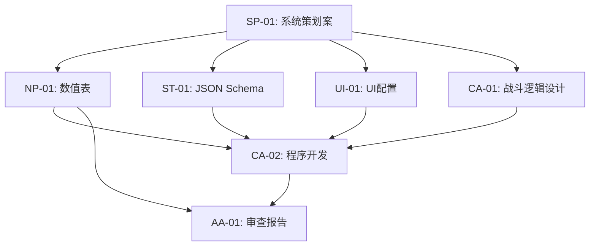

好的，资深游戏开发项目经理。已收到终审通过的好友系统设计草案。现在，我将根据项目宪法和下游Agent的职能边界，进行详细的WBS拆解。

---

## 好友系统 - WBS 任务拆解计划

### 1. 任务分解

#### 1.1 System Planner (系统策划)

- **任务 ID:** SP-01
- **任务名称:** 好友系统详细规则与UI交互流程设计
- **输入文件:** `好友系统 - 宏观设计草案.md`
- **产出文件:** `好友系统_系统策划案.md`
- **具体内容:**
    - 细化好友容量、申请/删除/拉黑流程的状态机。
    - 设计助战系统的完整UI流程：关卡选择 -> 助战入口 -> 好友列表 -> 角色选择 -> 确认出战。
    - 定义友情点商店的详细商品列表、价格、限购次数。
    - 设计好友推荐列表的排序算法规则（等级、在线、助战强度权重）。
    - 明确好友主页展示的数据字段（看板娘、签名、战绩、好感度角色）。
    - 定义“赠送体力”、“点赞”等交互的UI反馈流程和触发条件。
    - 输出详细的UI线框图或交互流程图。

#### 1.2 Numerical Planner (数值策划)

- **任务 ID:** NP-01
- **任务名称:** 好友系统经济数值与成长曲线设计
- **输入文件:** `好友系统_系统策划案.md`
- **产出文件:** `好友系统_数值表.xlsx` (或 JSON)
- **具体内容:**
    - **好友位扩容曲线：** 设计初始20人，扩容至50人所需的信用点/等级/数据金消耗表。
    - **友情点产出曲线：** 精确计算每日通过赠送体力、点赞、助战可获得的友情点上限（如：赠送体力 5点/次，点赞 2点/次，被借用 10点/次）。
    - **友情商店定价：** 设定单抽券碎片、养成材料、信用点的单价及每月限购数量，确保每月总消耗与产出平衡。
    - **助战奖励上限：** 设定借出方每日10次、借用方每日5次的奖励上限。
    - **日常/周常任务数值：** 定义“赠送好友体力3次”、“借用助战1次”等任务奖励的数值。

#### 1.3 Schema Translator (格式翻译)

- **任务 ID:** ST-01
- **任务名称:** 将系统策划案翻译为结构化JSON Schema
- **输入文件:** `好友系统_系统策划案.md`
- **产出文件:** `好友系统_Schema.json`
- **具体内容:**
    - 将系统策划案中的所有数据结构（好友信息、助战记录、友情点交易、商店商品等）翻译为符合项目规范的JSON Schema。
    - 定义字段类型、约束、默认值、主键/外键关联。
    - 确保Schema与项目已有的角色、战斗、邮件等系统的数据模型兼容。

#### 1.4 UI Agent (UX/UI 设计)

- **任务 ID:** UI-01
- **任务名称:** 好友系统前端表现与交互配置
- **输入文件:** `好友系统_系统策划案.md`, `好友系统_Schema.json`
- **产出文件:** `好友系统_UI配置.json`
- **具体内容:**
    - **好友列表卡片：** 配置3D模型缩略图的展示参数（相机位置、缩放、待机动作）。
    - **助战选择界面：** 配置角色高清模型展示的旋转控制、登场动画触发逻辑、语音播放配置。
    - **好友主页：** 配置看板娘展示、签名、战绩、好感度角色的UI布局。
    - **交互反馈：** 配置“赠送体力/点赞”时，看板娘做出感谢动作（飞吻/比心）的动画、语音、UI弹窗的触发与表现。
    - **助战结算：** 配置助战角色在结算界面的站位、胜利动作和语音。
    - **UI规范：** 确保所有UI元素不遮挡角色模型，符合项目宪法【禁忌3】。

#### 1.5 Combat Agent (战斗策划)

- **任务 ID:** CA-01
- **任务名称:** 助战系统战斗逻辑与数据交互设计
- **输入文件:** `好友系统_系统策划案.md`, `好友系统_Schema.json`
- **产出文件:** `好友系统_战斗逻辑设计.md`
- **具体内容:**
    - **助战角色数据加载：** 定义如何从服务器读取好友的助战角色配置（等级、技能、武器、后勤）。
    - **出战逻辑：** 明确助战角色作为第四人加入战斗，不占用玩家编队位置。
    - **战斗结算：** 定义助战角色的伤害统计、死亡判定（不影响评价）、奖励计算逻辑。
    - **关卡限制：** 配置哪些关卡（如高难本）禁用助战功能。
    - **与战斗系统交互：** 定义战斗系统如何调用好友列表数据，以及战斗结束后如何向好友系统发送奖励通知。

#### 1.6 Code Agent (程序执行)

- **任务 ID:** CA-02
- **任务名称:** 好友系统核心功能开发
- **输入文件:** `好友系统_Schema.json`, `好友系统_UI配置.json`, `好友系统_战斗逻辑设计.md`, `好友系统_数值表.xlsx`
- **产出文件:** `好友系统_核心逻辑.gd`, `好友系统_UI.gd`, `好友系统_网络.gd` (GDScript代码)
- **具体内容:**
    - **后端逻辑：** 实现好友管理（申请/同意/删除/拉黑）、助战数据同步、友情点交易、邮件通知等服务器端逻辑。
    - **前端逻辑：** 实现好友列表UI、助战选择UI、好友主页UI、交互反馈动画/语音播放、助战结算UI。
    - **网络通信：** 实现客户端与服务器之间的好友数据请求、响应、推送。
    - **数据持久化：** 实现好友关系、友情点、助战记录等数据的本地存储与云端同步。

#### 1.7 Audit Agent (审查官)

- **任务 ID:** AA-01
- **任务名称:** 好友系统数值与规则平衡性审查
- **输入文件:** `好友系统_系统策划案.md`, `好友系统_数值表.xlsx`
- **产出文件:** `好友系统_审查报告.md`
- **具体内容:**
    - **数值平衡：** 审查友情点产出与消耗曲线是否合理，是否会导致玩家过度依赖助战而降低自身养成动力。
    - **规则平衡：** 审查助战限制（每日次数、高难本禁用）是否有效防止了养成动力下降。
    - **商业化平衡：** 审查好友位扩容的付费点是否合理，是否对免费玩家造成过大压力。
    - **风险提示：** 指出任何可能导致经济系统崩溃或玩家体验下降的数值风险点。

---

### 2. 执行顺序与依赖

#### 串行依赖 (必须按顺序执行)
1.  **SP-01 -> 所有下游任务：** 系统策划案是所有后续工作的唯一输入源，必须最先完成并终审。
2.  **ST-01, NP-01, UI-01, CA-01 -> CA-02：** 程序开发需要依赖Schema、数值、UI配置和战斗逻辑设计，这些任务完成后才能开始编码。
3.  **CA-02, NP-01 -> AA-01：** 审查官需要基于最终的代码实现和数值表进行审查，因此审查是最后一步。

#### 并行任务 (可同时进行)
- **NP-01, ST-01, UI-01, CA-01** 这四个任务在SP-01完成后，可以**并行**开展。它们之间没有强依赖关系，可以分配给不同的Agent同时工作。

---

### 3. 风险提示

1.  **阻塞点：SP-01 系统策划案质量**
    - **风险：** 如果系统策划案对UI流程、交互反馈、数据字段定义不够清晰，将导致下游所有Agent（NP, ST, UI, CA）返工，造成项目延期。
    - **缓解措施：** SP-01产出后，需组织所有下游Agent进行联合评审，确保理解一致。PM需严格把关，确保策划案达到“可执行”的详细程度。

2.  **跨团队依赖冲突：CA-01 与 战斗系统**
    - **风险：** 战斗策划（CA-01）设计的助战逻辑，可能需要修改现有的战斗系统核心代码（如编队逻辑、结算逻辑）。如果战斗系统团队资源紧张或架构不兼容，将导致阻塞。
    - **缓解措施：** 在CA-01设计初期，需与战斗系统主程进行技术预研，评估改动量。必要时，将助战逻辑设计为战斗系统的“插件”或“扩展”，减少对核心代码的侵入。

3.  **数据同步风险：CA-02 好友数据实时性**
    - **风险：** 好友的助战角色配置、看板娘、在线状态等数据需要实时或准实时同步。如果网络同步方案设计不当，会导致玩家看到过时的数据（如借到一个已经换掉装备的角色），体验极差。
    - **缓解措施：** 在CA-02开发前，需与后端主程明确数据同步策略（如：进入助战选择界面时拉取最新数据，或使用WebSocket推送状态变更）。需进行压力测试，确保高并发下数据一致性。

4.  **表现层实现难度：UI-01 3D模型展示**
    - **风险：** 在好友列表、助战选择等界面展示3D模型缩略图，并播放动画和语音，对客户端性能（内存、渲染）有较高要求。低端设备可能出现卡顿或闪退。
    - **缓解措施：** UI-01需与客户端主程沟通，制定性能优化方案（如：模型LOD、动画压缩、纹理图集）。在开发阶段需进行多机型兼容性测试。