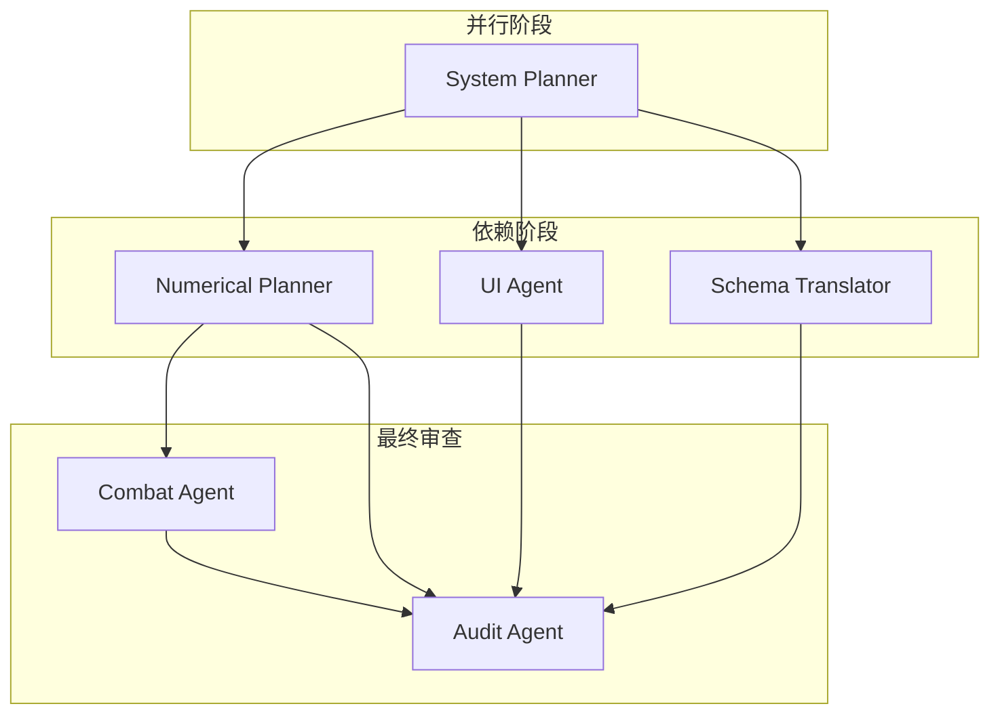

【归档评语】：该系统为系统玩法，没有战斗策划涉及的部分，不该有战斗策划的WBS拆解出来

【适用领域】：工作流调度

---
### 角色宿舍大厅 - 错误案例

#### 💡 【核心问题总结】
- **【致命缺陷】**：WBS拆解中错误地引入了“战斗策划（Combat Agent）”作为独立任务节点，并为其分配了“好感度等级-战斗属性加成”的配置工作。该系统的核心是纯养成与社交玩法，战斗属性挂钩仅为数值策划的附属产出，不应单独拆出一个战斗策划的WBS任务，导致工作流冗余且职责边界混乱。
- **【避坑铁律】**：在进行系统WBS拆解时，必须严格遵循“系统玩法边界”原则。如果目标系统（如宿舍、大厅、换装）不涉及战斗逻辑、技能释放、伤害计算等核心战斗模块，则【绝对禁止】将“战斗策划”作为独立Agent或任务节点纳入拆解。其相关的数值配置（如属性加成）应作为数值策划的产出子项，或直接由数值策划在最终配置中完成，无需额外增加一个战斗策划的WBS层级。

#### 🦴 【失败脱水骨架 (原样保留)】 [读取优先级：Low]
*(⚠️ 最高警告：以下为犯罪现场原貌，绝对不可作为正确格式参考！)*
```text
好的，资深游戏开发项目经理。已收到终审通过的系统设计草案《角色宿舍大厅》。根据项目宪法和下游Agent职能边界，我将对该系统进行WBS拆解，并制定详细的执行计划。

---

## 1. 任务分解

### 1.1 System Planner (系统策划)

- **任务名称:** 宿舍系统玩法细节与交互流程设计
- **输入文件:** `角色宿舍大厅 - 宏观设计草案.md`
- **产出文件:** `system_design_dormitory.md`
- **具体任务:**
    1.  细化好感度等级（1-10级）每级解锁的具体内容清单（动作、语音、剧情ID、功能权限）。
    2.  设计“触摸互动”的判定区域（头、肩、手、手臂、腰侧、小腿、耳根、腰侧）及其对应的反馈ID（语音、动作、表情）。
    3.  设计“日常动作循环”的状态机：定义3-4种状态（看书、发呆、伸展、摆弄物件），切换逻辑（时间/随机），以及角色看向镜头的触发条件。
    4.  设计“拍照模式”的UI布局、功能按钮（滤镜、姿势切换、截图）及操作逻辑。
    5.  设计“换装”功能的UI入口、操作流程（选择皮肤->预览->确认）。
    6.  明确“对话”系统的交互逻辑：每日问候触发、玩家回复选项、对当日心情状态的影响（仅表现层）。
    7.  输出一份详细的交互流程图（可用文字描述状态转换）。

### 1.2 Numerical Planner (数值策划)

- **任务名称:** 宿舍系统经济循环与好感度数值设计
- **输入文件:** `角色宿舍大厅 - 宏观设计草案.md`, `system_design_dormitory.md` (依赖系统策划产出)
- **产出文件:** `numerical_design_dormitory.json`
- **具体任务:**
    1.  设计好感度从1级升到10级所需的累计经验值曲线。
    2.  设计每日行为（触摸、送礼、对话）产出的好感度经验值数值。
    3.  设计“礼物道具”的数值：基础礼物、高级礼物的经验值，以及角色喜好标签的加成系数。
    4.  设计“加速道具”的数值：跳过每日互动次数限制的道具效果与定价。
    5.  设计好感度等级与战斗属性的弱挂钩数值（每5级提供微量暴击率/伤害加成）。
    6.  设计宿舍系统内基础货币的产出与消耗循环（如有）。
    7.  输出JSON格式的数值表。

### 1.3 Schema Translator (格式翻译)

- **任务名称:** 将系统设计草案翻译为结构化JSON Schema
- **输入文件:** `角色宿舍大厅 - 宏观设计草案.md`
- **产出文件:** `schema_dormitory.json`
- **具体任务:**
    1.  将草案中的系统元数据（`system_name`, `primary_tag`）提取并填入JSON。
    2.  将草案中的各个章节（概述、核心规则、表现层、经济、依赖、风险）翻译为JSON Schema的字段定义。
    3.  确保JSON Schema符合项目要求的格式规范。
    4.  将产出文件提交给**Audit Agent**进行格式校验。

### 1.4 UI Agent (UX/UI 设计)

- **任务名称:** 宿舍大厅UI/UX设计与交互原型
- **输入文件:** `角色宿舍大厅 - 宏观设计草案.md`, `system_design_dormitory.md` (依赖系统策划产出)
- **产出文件:** `ui_design_dormitory.md` (包含UI布局图、交互说明、视觉风格规范)
- **具体任务:**
    1.  设计宿舍大厅主界面布局：角色展示区域、功能按钮（触摸、送礼、对话、换装、拍照、设置）的排布。
    2.  设计“触摸互动”的UI反馈：触摸点特效、好感度变化提示、角色表情/语音气泡。
    3.  设计“拍照模式”的UI：滤镜选择、姿势切换、截图按钮、UI隐藏开关。
    4.  设计“换装”界面的UI：角色预览、皮肤列表、确认/取消按钮。
    5.  设计“好感度”UI：等级进度条、解锁内容预览、下一级提示。
    6.  遵循“UI透明化”原则，所有UI组件采用半透明毛玻璃设计，并提供一键隐藏功能。
    7.  输出UI布局图（可用文字描述或伪代码表示布局结构）和交互说明。

### 1.5 Combat Agent (战斗策划)

- **任务名称:** 宿舍系统与战斗系统的弱挂钩数值配置
- **输入文件:** `numerical_design_dormitory.json` (依赖数值策划产出)
- **产出文件:** `combat_link_dormitory.json`
- **具体任务:**
    1.  根据数值策划提供的“好感度等级-战斗属性加成”表，生成战斗系统可读取的JSON配置。
    2.  配置内容：好感度等级区间（如1-4级，5-9级，10级）对应的属性加成ID和数值。
    3.  确保该配置不会影响战斗核心平衡，仅作为养成奖励的附属品。

### 1.6 Audit Agent (审查官)

- **任务名称:** 宿舍系统设计合规性与数值平衡审查
- **输入文件:** `schema_dormitory.json`, `numerical_design_dormitory.json`, `ui_design_dormitory.md`
- **产出文件:** `audit_report_dormitory.md`
- **具体任务:**
    1.  **格式审查:** 检查 `schema_dormitory.json` 是否符合项目JSON Schema规范。
    2.  **数值审查:** 检查 `numerical_design_dormitory.json` 中的数值曲线是否合理，是否存在数值膨胀或付费点过于强力的风险。
    3.  **红线审查:** 检查所有设计是否符合项目宪法中的“设计红线与绝对禁忌”，特别是：
        -   触摸区域是否严格限定在“非隐私部位”。
        -   敏感区域（耳根、腰侧）的反馈是否为“害羞躲闪+脸红”，不涉及性暗示。
        -   是否存在任何可能导致NTR或角色与NPC暧昧的设计。
    4.  **性能审查:** 评估UI设计、动作循环等对移动端性能的潜在影响，并提出优化建议。
    5.  输出审查报告，列出所有通过项、警告项和驳回项。

---

## 2. 执行顺序与依赖



### 2.1 并行任务（第一阶段）
- **System Planner (系统策划):** 独立进行，不依赖其他Agent。
- **Schema Translator (格式翻译):** 独立进行，输入仅为终审通过的草案。

### 2.2 串行任务（第二阶段）
- **Numerical Planner (数值策划):** 必须等待 **System Planner** 产出 `system_design_dormitory.md` 后，才能开始设计数值。
- **UI Agent (UX/UI 设计):** 必须等待 **System Planner** 产出 `system_design_dormitory.md` 后，才能开始设计UI。
- **Combat Agent (战斗策划):** 必须等待 **Numerical Planner** 产出 `numerical_design_dormitory.json` 后，才能开始配置战斗链接。

### 2.3 最终审查（第三阶段）
- **Audit Agent (审查官):** 必须等待 **Schema Translator**, **Numerical Planner**, **UI Agent**, **Combat Agent** 全部产出后，才能开始进行全面审查。

---

## 3. 风险提示

1.  **内容生产量风险 (高风险):**
    - **阻塞点:** 草案中要求每个角色独立制作5-10个互动动作、20+条语音、3-5段剧情。这是巨大的美术和音频产能消耗。
    - **依赖冲突:** 如果美术/音频团队产能不足，将直接导致系统无法按时上线，或只能覆盖少量核心角色。
    - **建议:** 在系统策划细化时，必须明确**最小可行版本 (MVP)** 的内容量（例如：首批仅覆盖3-5个高人气角色），并规划后续角色的分批更新计划。此风险需在项目周会上重点讨论。

2.  **触摸判定边界风险 (中风险):**
    - **阻塞点:** 草案中“敏感区域”的定义（耳根、腰侧）可能与法务/合规团队的最终解释存在偏差。
    - **依赖冲突:** 需要跨部门（法务/合规）沟通确认，若沟通不畅或标准变更，可能导致已完成的动画和反馈需要返工。
    - **建议:** 在系统策划设计触摸区域时，立即启动与法务/合规团队的沟通，并输出一份明确的“可触摸区域与反馈标准”文档，作为所有下游Agent的硬性约束。

3.  **性能风险 (中风险):**
    - **阻塞点:** 高精度模型+物理模拟+动作循环对移动端性能压力巨大。
    - **依赖冲突:** 如果性能优化不达标，可能导致系统在低端机型上无法运行或体验极差。
    - **建议:** 在UI Agent设计UI时，需考虑性能开销（如毛玻璃效果）。在Audit Agent审查时，需重点评估性能风险。建议技术团队提前进行性能摸底测试。

4.  **跨Agent依赖风险 (低风险):**
    - **阻塞点:** Numerical Planner和UI Agent都依赖System Planner的产出。如果System Planner延期，将导致后续所有任务阻塞。
    - **建议:** 项目经理需紧密跟进System Planner的进度，并设置明确的交付里程碑。
```
